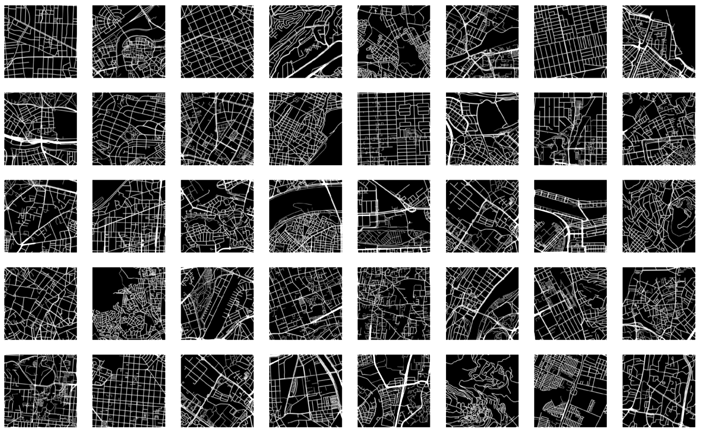
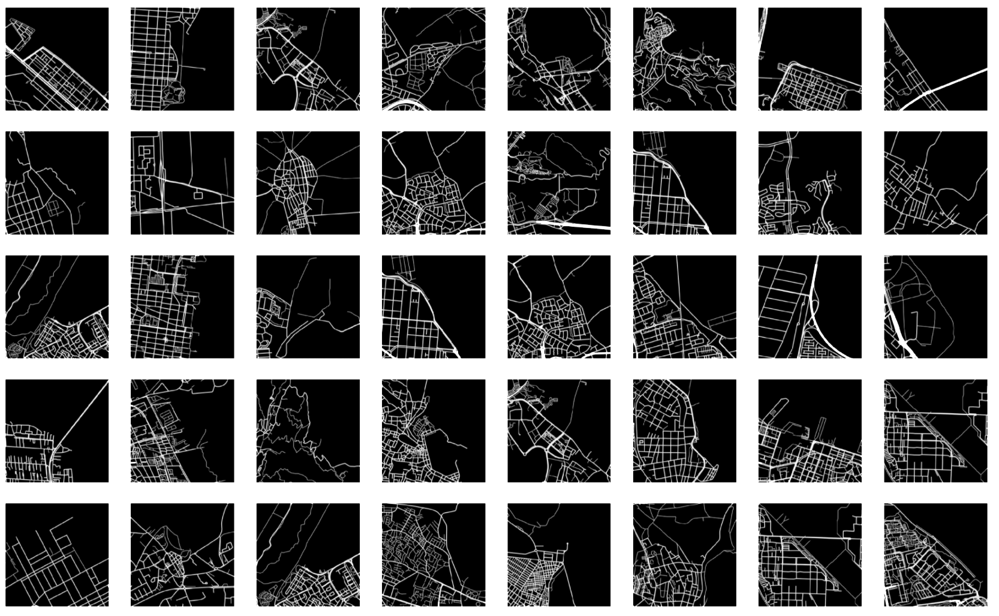
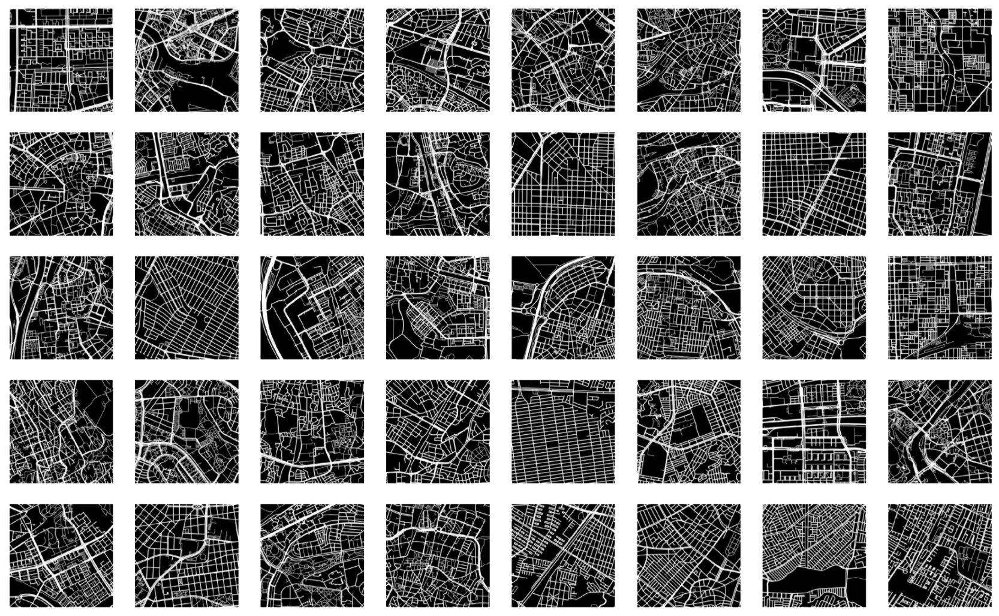

Learning from cities
===

_A project by @illpack and @k9martin for Saturdays AI Madrid, 2019_

Motivation
---

This project aims to address Urban Networks Design as a [wicked problem](https://en.wikipedia.org/wiki/Wicked_problem), _a problem whose social complexity means that it has no determinable stopping point_. Can Machine and Deep Learning techniques introduce significant changes in the way we design? Will AI overcome parametricism as the contemporary paradigm driving advanced architectural, structural and urban design?

The project can be divided in three sections: __Scrapping__, __Feature extraction__, __Generation__.

_Cluster 01_

_Cluster 02_

_Cluster 03_

### Scraping

We have used urban street networks as a proof of concept. To this end, we have generated a 6,6K+ images dataset from Open Street Maps, taking background-figure snapshots of urban networks.  

### Feature extraction

We have used deep convolutional autoencoders to reduce dimensionality and extract a vector of most relevant features. Then we have clustered this lower dimensional output and observed the groups: while certain composition bias can be ascertained, using different error metrics and a variable number of output dimensions yielded some interesting patterns.  

### Generation

We have used Deep Convolutional Generative Adversarial Networks to generate artificial networks from our dataset. Without much fine-tuning, the results, while not really performant, start to yield structures and patterns of thin lines, that group themselves in given directions, pretty much showing a high-level definition of a street network. 

***

### Resources

#### [Build a GAN with Keras](https://towardsdatascience.com/gan-by-example-using-keras-on-tensorflow-backend-1a6d515a60d0)

*   [__Strided Convolution__](https://www.coursera.org/lecture/convolutional-neural-networks/strided-convolutions-wfUhx)
    This means convolving a `NxN` matrix with a `fxf` filter applying a padding of `p` and a stride of `s`. The stride equals the number of steps that the filter will jump per iteration. So a stride of 2 would reduce the input to `0.5*Nx0.5*N`. Generally: `output = (N + 2*p - f) / s + 1`

*   [__Max-pooling__](https://www.quora.com/What-is-max-pooling-in-convolutional-neural-networks)
